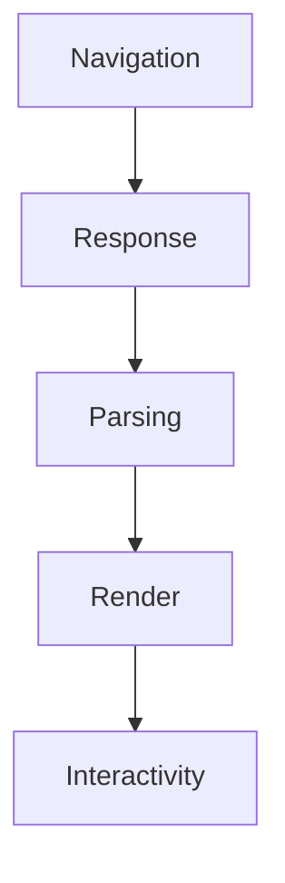
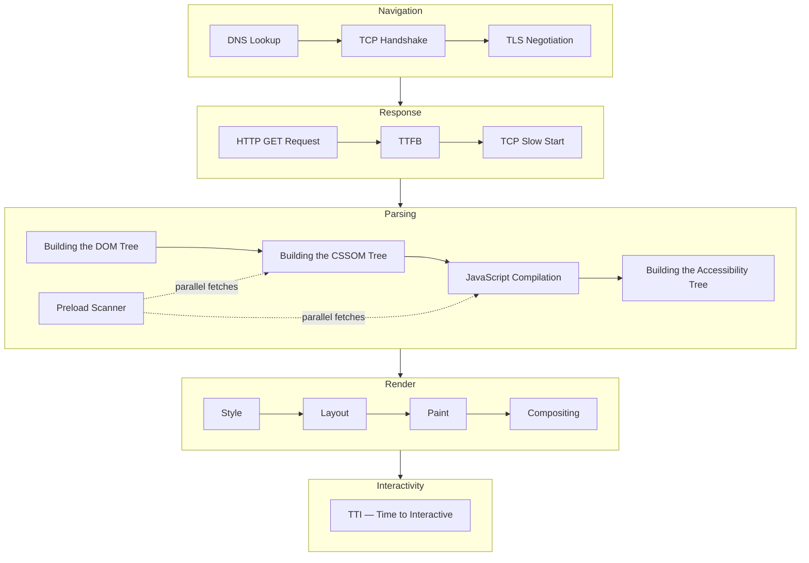
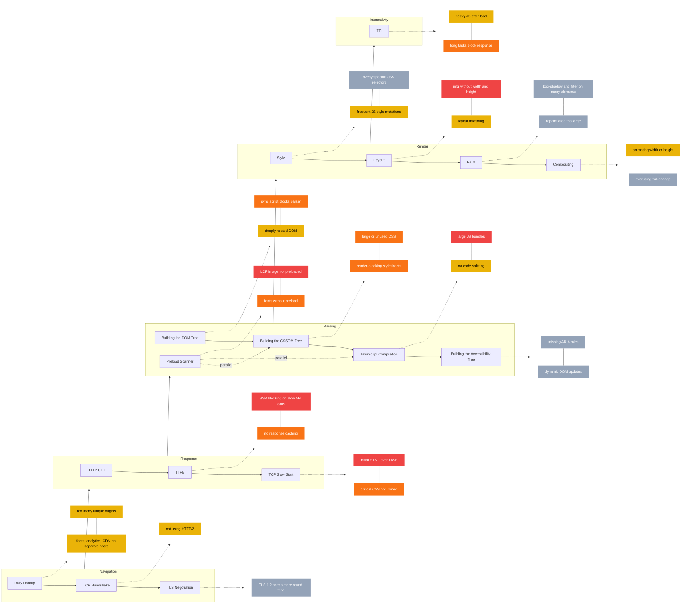

# How Browsers Work — Diagram

> Source: [Populating the page: how browsers work — MDN](https://developer.mozilla.org/en-US/docs/Web/Performance/Guides/How_browsers_work)

---

## Key MDN Quotes

> "Two major issues in web performance are issues having to do with latency and issues having to do with the fact that for the most part, browsers are single-threaded."

> "After the eight round trips to the server, the browser is finally able to make the request." *(DNS + TCP 3-way handshake + TLS 5 round trips)*

> "The first chunk of content is usually 14KB of data." *(TCP slow start)*

> "While the browser builds the DOM tree, this process occupies the main thread. As this happens, the preload scanner will parse through the content available and request high-priority resources like CSS, JavaScript, and web fonts."

> "Building the CSSOM is very, very fast... the total time to create the CSSOM is generally less than the time it takes for one DNS lookup."

> "JavaScript is parsed, compiled, and interpreted. The scripts are parsed into abstract syntax trees. Some browser engines take the abstract syntax trees and pass them into a compiler, outputting bytecode."

> "The browser also builds an accessibility tree that assistive devices use to parse and interpret content... Until the AOM is built, the content is not accessible to screen readers."

> "The first time the size and position of each node is determined is called layout. Subsequent recalculations of layout are called reflows."

> "To ensure smooth scrolling and animation, everything occupying the main thread, including calculating styles, along with reflow and paint, must take the browser less than 16.67ms to accomplish."

> "Promoting content into layers on the GPU (instead of the main thread on the CPU) improves paint and repaint performance. There are specific properties and elements that instantiate a layer, including `<video>` and `<canvas>`, and any element which has the CSS properties of `opacity`, a 3D `transform`, `will-change`."

> "Time to Interactive (TTI) is the measurement of how long it took from that first request which led to the DNS lookup and TCP connection to when the page is interactive — interactive being the point in time after the First Contentful Paint when the page responds to user interactions within 50ms."

---

## C1 — Overview

---

## C2 — Detailed

---

## C3 — Pitfalls

**Legend**

🔴 Critical — direct, measurable hit on Core Web Vitals
🟠 High — significant impact, fix after critical
🟡 Medium — worth addressing once high items are resolved
⚫ Low — MDN explicitly flags these as not worth chasing first

---

## The Two Root Problems (per MDN)

| Problem | What it means | What it affects |
|---------|--------------|-----------------|
| **Latency** | Time to transmit bytes over the network. DNS + TCP + TLS = 8 round trips before a single byte of content is received. | TTFB, FCP, LCP |
| **Single-threaded main thread** | Style, Layout, Paint, and JS all run on one thread. If JS is executing, the browser cannot respond to interactions. Budget is 16.67ms per frame. | INP, CLS, jank |

## Key Optimization Levers per Phase

| Phase | Bottleneck | Lever |
|-------|-----------|-------|
| **Navigation** | DNS per unique hostname (fonts, CDN, analytics each cost 1 lookup) | `dns-prefetch`, consolidate origins |
| **Response** | 14KB TCP slow start limit — content beyond 14KB needs extra round trips | Inline critical CSS, keep SSR HTML under 14KB for first paint |
| **Parsing** | Sync `<script>` blocks HTML parser; CSSOM blocks render tree | `async` / `defer` on scripts, `<link rel="preload">` for LCP image |
| **Render — Layout** | `` / `<video>` without `width` + `height` cause reflow → CLS | Always set dimensions on media elements |
| **Render — Paint** | Layers are expensive on memory; too many hurt, too few hurt scroll | Promote only scroll/animation elements via `will-change: transform` |
| **Interactivity** | JS running after load blocks TTI; heavy handlers block INP | Code-split, defer non-critical JS, keep event handlers under 50ms |

---

*Source: [MDN — Populating the page: how browsers work](https://developer.mozilla.org/en-US/docs/Web/Performance/Guides/How_browsers_work)*
